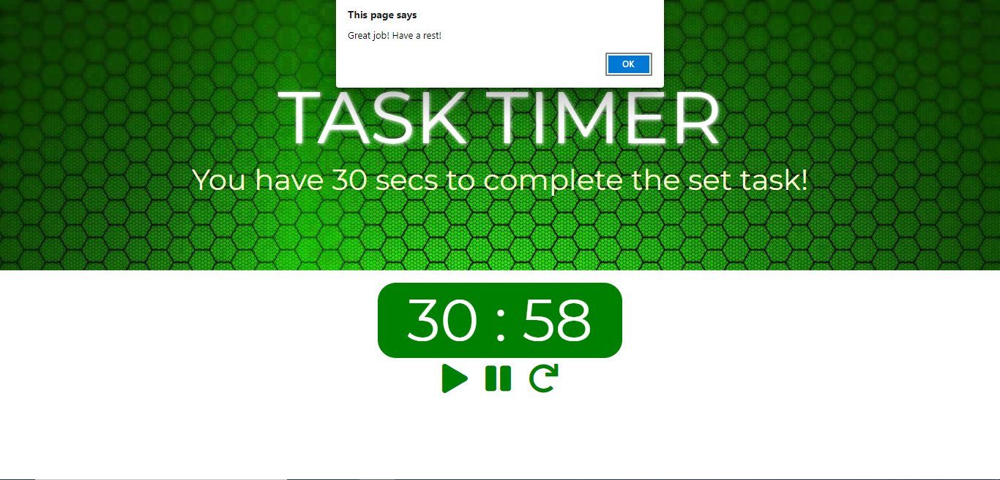

<h1> TASK TIMER - Pomodoro </h1>
Task Timer sets a time of 30 seconds for you to perform a given task. You can use this solution for games where someone is required to perform a given amoount of task in 30 seconds. Similarly, you can use this to test typing speed and see how any words player can complete in 30 seconds.

In this application, you can find three buttons to start, to pause and to reset the process.

<h2> Result </h2> 

